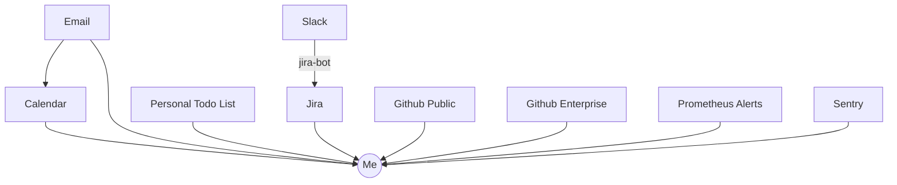
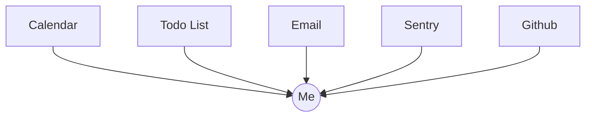
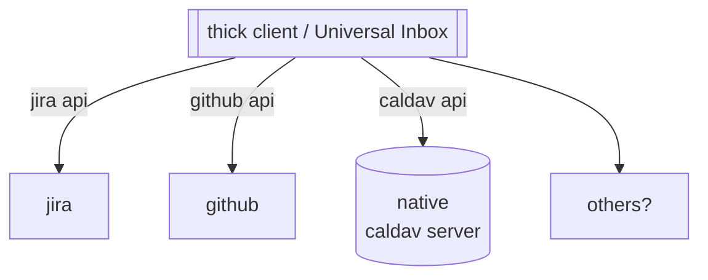
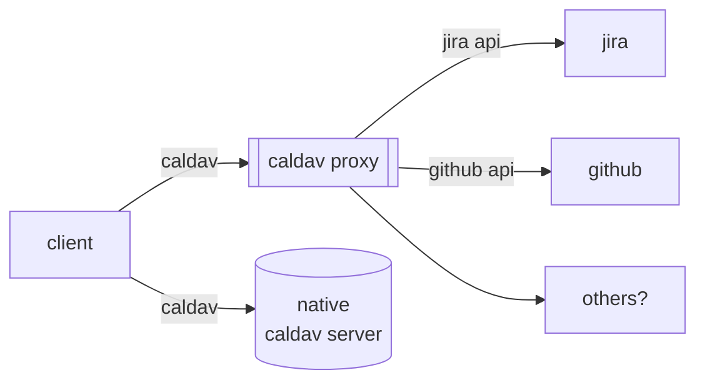

How many inboxes do you have?

A few years ago I read a book [Time Management for System Administrators](https://www.oreilly.com/library/view/time-management-for/0596007833/) which I sometimes summarize as “Don’t try to remember it, write it down”. Reading parts of [Getting Things Done](https://gettingthingsdone.com/what-is-gtd/) I also feel like I could summarize it in a similar way. Many of these systems have some concept of an Inbox for where tasks enter. One issue though is how many inboxes do you actually have ?

At work, this feels especially bad at times, as I have tasks coming from Email, from Slack, from Github, and from any other number of sources. Many sources also feed into one another, resulting in quite a lot of time triaging everything.

At home I have a few less but still too many.

I could do a first pass of triage to move each individual item to a single inbox (lets hope they support permalinks back) but I don't necessarily want to spend all this time in triage.

# Thick Client

When you have a client that can speak many different protocols, I think of this as a kind of **thick** client. Often you see an app like this advertised as some kind of **universal inbox**. The idea is that you can have one app that talks to all of your different inboxes.

With a thick client, we save some time having a single overview for reports and such, though our single application needs to understand each of the different inboxes we want to support.

# Regular Client + Proxy Server

Similar to the problem [language server protocol] solves for coding editors, if you can pick a single standard to communicate on, and then have a proxy for all the others, then parts of your job becomes easier. Now you can write your main app for the common protocol, and handle all the differences in the proxy layer.

Since I enjoy tinkering with [swift] and have played with [EventKit] some, I've done some experiments with my [caldavframework] for django and [github bridge] to use caldav as the common language for my multiple inboxes. My prototypes have worked somewhat, but caldav is not the easiest protocol to work with (it is built on top of dav and a lot of xml). Even though EventKit makes some things fairly easy (you can let iOS worry about syncing all of your calendars) it's not a full CalDav client, so there are many things in the CalDav spec that you don't have access to.

Even though EventKit gives me a lot for free (syncing is not something I really want to implement) and it's nice that it's ultimately built on an open standard (I like embracing existing standards like caldav when possible) it definitely feels a bit messy with a lot of layers and caching and conversions included. Ultimately I'm not sure what system would work best.

[language server protocol]: https://langserver.org/
[caldavframework]: https://github.com/kfdm/caldavframework
[github bridge]: https://github.com/kfdm/ghi-bridge
[eventkit]: https://developer.apple.com/documentation/eventkit
[swift]: /tags/swift
